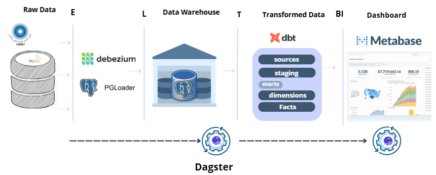

# 📦 Data Pipeline: MySQL → PostgreSQL + Kafka + Dagster + DBT + Metabase

Ce projet met en place un pipeline de données complet qui :

- 🔄 **Migre les données** de **MySQL** vers **PostgreSQL** (via `pgloader`)  
- 🔁 **Capture les changements** avec **Debezium** et les transmet à **Kafka**  
- ⚙️ **Orchestre** les traitements avec **Dagster**  
- 🛠️ **Transforme** les données dans PostgreSQL avec **DBT**  
- 📊 **Analyse et visualise** les données dans **Metabase**


## 📚 Table des matières

1. [Architecture du Pipeline](#-architecture-overview)  
2. [Installation et Configuration de la Partie Extraction](#-extraction-migration)  
3. [Installation et Configuration de DBT](#-dbt-installation-et-configuration)  
4. [Intégration Dagster](#-dagster-integration)  
5. [Installation et Configuration de Metabase](#-metabase-installation-et-configuration)  
6. [Démarrage du Pipeline](#-demarrage-du-pipeline)  

---

## 🗺️ Architecture Overview

```text
MySQL (source) → pgloader → PostgreSQL (target)
          |
       (Debezium CDC)
          ↓
       Kafka (broker)
          ↓
     Dagster (orchestration & DQ)
          ↓
     Metabase (BI & dashboarding)


---
## 🗺️ Architecture du Pipeline

Voici l’architecture globale de la solution :



```text
MySQL (source) 
  │
  ├──▶ pgloader (migration initiale)
  │
  └──▶ Debezium → Kafka (CDC)
                          │
                          └──▶ Dagster (orchestration)
                                    │
                                    ├──▶ DBT (transformations SQL dans PostgreSQL)
                                    │
                                    └──▶ PostgreSQL (données transformées)
                                                │
                                                └──▶ Metabase (visualisation)

Pipeline ELT : Extract, Load, Transform
Extraction : les données sont extraites de MySQL (source).

Chargement : les données brutes sont chargées dans PostgreSQL, via pgloader (migration initiale) ou via Debezium + Kafka (CDC en temps réel).

Transformation : DBT transforme et modélise les données dans PostgreSQL, préparant les tables pour l’analyse.

Visualisation : Metabase permet de créer des dashboards basés sur les données transformées.

L’orchestration globale est gérée par Dagster qui lance les étapes DBT, contrôle la qualité des données, etc.
🔧 Extraction & Migration (pgloader, Debezium, Kafka)
## 🐳 Docker Services

| Service          | Description                                      |
|------------------|--------------------------------------------------|
| source-mysql     | MySQL 5.7 instance with initialized data         |
| target-postgres  | PostgreSQL 15 for storing migrated data          |
| pgloader         | One-time migration from MySQL to PostgreSQL      |
| zookeeper        | Zookeeper instance required for Kafka            |
| kafka            | Apache Kafka message broker                      |
| debezium         | Debezium CDC connector for MySQL to Kafka        |
| metabase         | Visualization and BI dashboard    

## 🛠️ Requirements
1. Installation Python / Dagster

pip install  pandas==1.5.3 numpy==1.23.5 SQLAlchemy==1.4.5
pip install dagster==1.11.2 dagster-webserver==1.11.2 dagster-graphql==1.11.2 \
            dagster-dbt==0.27.2 dagster-postgres==0.27.2 dagster-ge==0.27.2

🚀 Getting Started
Clone the repository:

bash
git clone <repo-url>
cd <repo-folder>
Start the stack:

bash
docker-compose up --build

Metabase: http://localhost:3001

Dagster: http://localhost:3000 (après démarrage avec dagster dev)

Identifiants des bases

Composant  	Host	      Port	   DB  Name	   User	       Password
MySQL	      localhost	  3307	   uatrs_db	   uatrs_user	 uatrs_pass
PostgreSQL	localhost 	5433	   uatrs_db	   uatrs_user  uatrs_pass


🛠️ DBT Installation et Configuration
Créer un environnement virtuel et activer

python -m venv dbt_venv
# Sur Windows PowerShell
.\dbt_venv\Scripts\Activate.ps1
# Sur Linux/Mac
source dbt_venv/bin/activate
Installer DBT

pip install dbt-core dbt-postgres
Cloner le projet DBT (ou utiliser le dossier existant)

git clone https://github.com/Idriss-Abidi/DataWarehouse_BI
Configurer le fichier profiles.yml

Exemple :

yaml
dbt_proj:
  outputs:
    dev:
      type: "postgres"
      host: "localhost"
      user: "your_user"
      password: "your_password"
      port: 5432
      dbname: "ourDatabase"
      schema: "public"
      threads: 1
  target: "dev"
Tester la connexion

dbt debug
Lancer les transformations

dbt deps
installer les dependances

dbt run
pour excéuter vos models

dbt docs generate
dbt docs serve
dont le but est de voir DAG de vos models pour en pouvoir visualiser les dépendances
 
🛠️ Détails sur l'exécution de DBT avec variables d’environnement

Avant de lancer les commandes DBT, il est nécessaire d’exécuter un script envbat (ou tout autre script d’environnement) qui permet de charger les variables d’environnement nécessaires au fonctionnement global du pipeline.

Pourquoi exécuter envbat ?
Ce script définit des variables d’environnement (par exemple des chemins, des clés API, des paramètres de connexion...) indispensables au bon fonctionnement des étapes suivantes.

Sans ces variables, certains scripts, notamment le script Python de génération de fichiers SQL, risquent de ne pas fonctionner correctement.

##Processus complet

#Lancer le script env.bat

call env.bat

#Cela charge toutes les variables d’environnement dans la session actuelle.

#Exécuter le script Python de génération des fichiers SQL

Ce script crée automatiquement plusieurs fichiers .sql, un par ID disponible .
Ces fichiers SQL font appel à des macros DBT réutilisables, permettant de standardiser et simplifier les transformations.

Se positionner dans le dossier DBT

cd <chemin_du_dossier_dbt>

Lancer DBT pour compiler et exécuter les modèles

⚙️ Dagster Integration
Installer Dagster et plugins DBT

pip install dagster dagster-dbt dagster-webserver
Scaffold un projet Dagster DBT
dagster-dbt project scaffold --project-name my_dagster_project --dbt-project-dir <path_to_dbt_project>

Lancer Dagster
cd my_dagster_project
dagster dev -p 4000

Interface accessible sur http://localhost:4000

📊 Metabase Installation et Configuration

Installer Metabase avec Docker

docker pull metabase/metabase
docker run -d --name metabase -p 3000:3000 <path_to_dashboard_folder>:/metabase.db metabase/metabase

Accéder à Metabase

http://localhost:3000

Configurer la connexion à PostgreSQL

Database Name: <database_name>
Host: host.docker.internal
Port: 5432
Username: postgres (ou celui configuré)
Password: <votre_mot_de_passe>

Créer vos dashboards
🏁 Démarrage complet du pipeline

docker-compose up --build pour lancer les services

dagster dev -p 4000 pour Dagster

Accéder aux dashboards Metabase

Lancer les pipelines et transformations via Dagster
